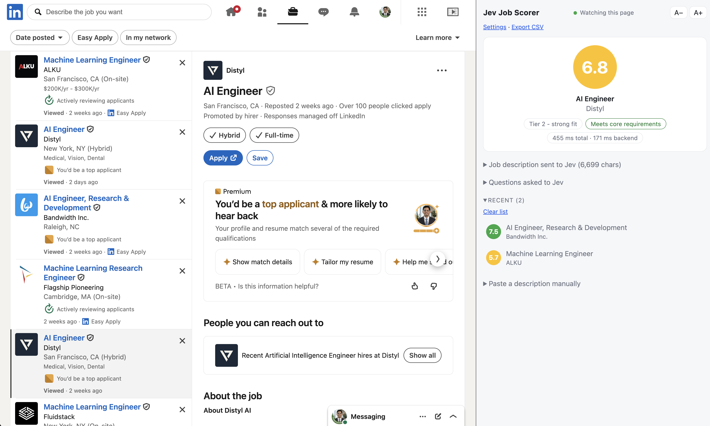

# Jev Job Scorer

[](LICENSE)


A Chrome extension that reads the job posting on your screen and scores it **0–10** against your resume using the Jev model (TypeSafe API). Click a job, and the score shows up in a side panel within about a second. No copy-pasting.



## Features

- **Automatic detection.** Watches the page for changes (no polling) and scores the job as soon as it settles.
- **Side panel that stays open.** Click the toolbar icon once; it keeps scoring as you browse.
- **Score, tier, and "meets core requirements"** for every job, plus a history of your last scored jobs.
- **Transparent.** See the exact text and the exact questions sent to the model.
- **Cheap.** Results are cached by resume + job text, so a job you have already seen costs nothing.
- **Latency readout** on every result: end to end (detection to score on screen) and backend time.
- **CSV export** of your scored jobs. Adjustable text size.
- Zero dependencies, no build step. Plain JavaScript.

## Supported job boards

| Board | Where it runs |
| --- | --- |
| LinkedIn | `linkedin.com` |
| Indeed | `indeed.com` |
| Glassdoor | `glassdoor.com` |
| Greenhouse | `*.greenhouse.io` single-job pages |
| Ashby | `*.ashbyhq.com` single-job pages |
| Built In | `builtin.com/job/…` |

Other sites: paste the description into the side panel. (Right-click **Score this job** on selected text also works, but only shows the score as a badge on the toolbar icon.)

## Install

There is no build step. Load it unpacked:

1. Clone this repo: `git clone <repo-url>`
2. Open `chrome://extensions` and turn on **Developer mode**.
3. Click **Load unpacked** and pick the repo folder.
4. Open the extension's **Settings** page and enter your TypeSafe API key and your resume (paste it, or upload a `.txt`/`.md` file). Save.
5. Open a job on any supported board and click the Jev icon.

After editing the code, click the reload icon on the extension card, then hard-refresh the job tab (Cmd/Ctrl+Shift+R).

## How it works

```
job page ── content.js ──message──▶ background.js ──POST──▶ Jev API
              (detects job)            (cache, call, save)
                                            │
                                     chrome.storage.local
                                            │ onChanged
                                            ▼
                                  side panel (popup.html/js)
```

Full walkthrough in [docs/architecture.md](docs/architecture.md).

## Project layout

| File | Role |
| --- | --- |
| `manifest.json` | MV3 manifest: permissions, content-script sites, side panel |
| `content.js` | Finds the job text, detects when it settles, sends it for scoring, shows the floating score box |
| `background.js` | Service worker: cache lookup, Jev API call, retry, storage, context menu |
| `popup.html` / `popup.js` | Side panel UI: score card, history, sent text, questions, latency, CSV, text size |
| `options.html` / `options.js` | Settings: API key, resume, clear cache |
| `docs/` | Architecture notes |

## Privacy and data

- Your **resume and the job text are sent to `https://api.typesafe.ai`** for every new job you score. Nothing else is sent anywhere.
- Your API key, resume, and score history are stored in `chrome.storage.local` on your machine. This is **not encrypted**; anyone with access to your browser profile can read it.
- The extension scores automatically on supported boards, which uses your API quota. Remove the site from the manifest if you do not want that.
- Open **What was sent to Jev** in the side panel to see exactly what leaves your browser.

## Development

No tooling required. Syntax-check a file with `node --check content.js`. Debug with:

- the page console (filter `[Jev]`) for the content script
- **service worker** link on `chrome://extensions` for `background.js`
- right-click the side panel, **Inspect**, for the panel

See [CONTRIBUTING.md](CONTRIBUTING.md).

## Status

Early and personal-scale. Known limits: the cache matches on exact text and keeps 50 entries; "current job" is global, not per tab. Selectors for Greenhouse, Ashby and Built In are best guesses and may need tuning.

## License

[MIT](LICENSE)
